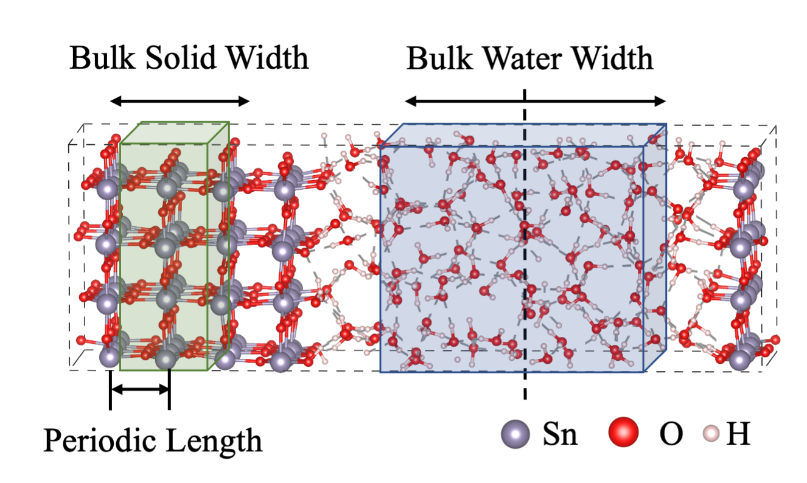

- [Introduction](#introduction)
- [Atom Density Analysis](#atom-density-analysis)
- [Band Alignment](#band-alignment)
  - [Quick Start](#quick-start)
  - [Prepare Input Data](#prepare-input-data)
  - [Explanation for Parameters](#explanation-for-parameters)
  - [Plot Band Alignment Data](#plot-band-alignment-data)
- [Acidity Calculation](#acidity-calculation)
  - [Calculate Dummy Insertion Free Energy](#calculate-dummy-insertion-free-energy)
  - [Calculate Quantum Correction Free Energy](#calculate-quantum-correction-free-energy)
  
# Introduction

A toolbox collect some postprocessing workflow

# Atom Density Analysis
```python
from ectoolkits.analysis.atom_density import AtomDensity

# from 
inp_dict={
     "xyz_file": "./Hematite-pos-1.xyz",
     "cell": [10.0564, 8.7091, 38.506],
     "surf2": [32, 33, 34, 35, 36, 37, 38, 39, 40, 41, 42, 43],
     "surf1": [112, 113, 114, 115, 116, 117, 118, 119, 120, 121, 122, 12],
     "density_type":[
         {
             "element": "O",
             "idx_method": "manual",
             "idx_list": O_idx,
             "density_unit": "water",
             "dz": 0.05,
             "name": "O_density"
             },
         {
             "element": "H",
             "idx_method": "manual",
             "idx_list": H_idx,
             "density_unit": "water",
             "dz": 0.05,
             "name": "H_density"
             }
         ]
 } 
ad = AtomDensity(inp_dict)
ad.run()

# detail information is accessible in 
ad.atom_density
ad.atom_density_z

# get average denstiy from center
width_list = [5, 6, 7, 8, 9, 10]
all_cent_density = ad.get_ave_density(width_list)

# quick plot for denstiy 
# if you want to symmetrize the density profile, set sym=True
ad.plot_density(self, sym=False)

```

# Band Alignment 
## Quick Start
```python
from ectoolkits..analysis.band_align import BandAlign
inp = {
     "input_type": "cube", 
     "ave_param":{
         "prefix": "./00.interface/hartree/Hematite-v_hartree-1_", 
         "index": (1, 502), 
         "l1": 4.8, 
         "l2": 4.8, 
         "ncov": 2, 
         "save": True,  
         "save_path":"00.interface"
     },
     "shift_param":{
         "surf1_idx": [124, 125, 126, 127, 128, 129, 130, 131],
         "surf2_idx": [24, 25, 26, 27, 28, 29, 30, 31]
     },
     "water_width_list": [8, 9, 9.5, 10, 10.5, 11, 12, 13],
     "solid_width_list": [1, 2, 3, 4]

}
ba = BandAlign(inp)
#quick view of hartree fluctuation
fig = ba.plot_hartree_per_width('water')
fig = ba.plot_hartree_per_width('solid')

# detail information is accessible in 
ba.water_hartree_list
ba.solid_hartree_list
```
## Prepare Input Data
One has to collect all hartree cube files from continuous MD simulations in one directory with same prefix and suffix of `.cube`.
For example, in directory `./00.interface/hartree/`, one should prepare cube file named `Hematite-v_hartree-1_1.cube`, `Hematite-v_hartree-1_2.cube`, ..., `Hematite-v_hartree-1_501.cube`.

## Explanation for Parameters

- `input_type`: `cube` for cp2k cube files
- `prefix`: define prefix for cube files
- `index`: define the index for cube files, see `Prepare Input Data`
- `l1`: parameter for nanosmoothing. `l1` equals to natural number (`n`) times periodic length (`pl`) for oxides slab. For example, the z position of a layer for $\mathrm{SnO_2}$(110) slab is defined as the ensemble-averaged z positions of $\mathrm{Sn}$ atoms in the layer. Then, the periodic length is inter-layer distance between two layers. Assuming `pl` is 2.4 $\mathrm{\AA}$, `l1` can be 2.4, 4.8, and 7.2 $\mathrm{\AA}$.
- `l2`: parameter for nanosmoothing. `l2` equals to natural number (`n`) times periodic length (`pl`) for water. Since water dose not have periodicity, we recommend to set `l2` same as `l1`.
- `ncov`: parameter for nanosmoothing. `ncov` is number of convolution. `ncov` equals to 2 for interfaces and equals to 1 for surface (slab-vacuum). When `ncov` is 1, `l2` won't be used.
- `save`: whether to save post processed hartree data. We recommend to set it as `True`.
- `save_path`: save_path for post processed hartree data.
- `surf1_idx`: `place holder`
- `surf2_idx`: `place holder`
- `water_width_list`: Width for bulk water. Bulk Water Width is plotted in above figure. Since one has to test multiple width value, the width is input as a list.
-  `solid_width_list`: Width for Bulk Solid. Bulk Solid Width is plotted in above figure. Since one has to test multiple width value, the width is input as a list.

## Plot Band Alignment Data
After Obtain band positions from post processing, you can plot these data using `plot_band_alignment`
```python
from ectoolkits.plots.band_align import plot_band_alignment

#prepare your band positions data in dictionary format
ba_data = {
    "sys_1": {
        "vbm": 1.0,
        "cbm": -0.5
    },
    "sys_2": {
        "vbm": 1.2,
        "cbm": -0.3
    },
    ....
}
fig = plot_band_alignment(ba_dict=ba_data, show_diff=True, vac_value=False)
fig.savefig("bandalignment.png")
```
We assume the vbm and cbm values are in SHE scale. If the vbm and cbm values are referred to Vacuum scale, set `vac_value=True`. If you want to plot the difference between band position of first system and other systems, set `show_diff=True`.


# Acidity Calculation
We refer to paper for detailed description
>1. Cheng, J., Sulpizi, M. & Sprik, M. Redox potentials and pKa for benzoquinone from density functional theory based molecular dynamics. J Chem Phys 131, 154504 (2009).
>2. Mangold, M. et al. Absolute pK a Values and Solvation Structure of Amino Acids from Density Functional Based Molecular Dynamics Simulation. J Chem Theory Comput 7, 1951–1961 (2011). 

The pKa of a species $\ce{AH}$ in aqueous solution is defined as 
$$
\ce{AH(aq) -> A^- (aq) + H^+ (aq)} \\
\mathrm{p}K_a = -\log{K_a}
$$
The final expression for $\mathrm{p}K_a$ is
$$
2.3 k_{\mathrm{B}} T\mathrm{p}K_a =   (\Delta_{\mathrm{dp}} A_{\ce{AH}} - \Delta_{\mathrm{dp}}  A_{\ce{H3O+}} - \Delta A_{\ce{Ad}} + \Delta A_{\ce{H2Od}} - \Delta A_{\mathrm{qc}} (\ce{AH}) + \Delta A_{\mathrm{qc}}(\ce{H3O+}) +  \Delta A_{\ce{H3O+}})
$$

## Calculate Dummy Insertion Free Energy

$\Delta A_{\ce{Ad}}$ is dummy inerstion free energy corresponding to 
$$
\ce{A^-(aq) + H+(g)->Ad^-(aq) }
$$
To calculate $\Delta A_{\ce{Ad}}$, you need calculate $\ce{Ad-}$ the vibrational frequency of mode i for dummy in gas phase. And save the frequncies as numpy array. Note that the unit of frequencies must be $cm^{-1}$. This function is straightforward implementation using eq.26 in reference[2].
```python
from ectoolkits.analysis.acidity import get_dummy_insert_fe
import numpy as np

# the frequencies you calculated from gas phase molecules
# these frequencies are taken from reference [2] for the arginine molecule.
frequencies_list = np.array([440, 1182, 2290])

get_dummy_insert_fe(frequencies_list, T=298)
```
The following output is 
```shell
> 0.315428
```

We also implemented function for obtaining $\Delta A_{\ce{H2Od}}$, since $\Delta A_{\ce{H2Od}}$ has a special formula for correction, as described in reference[1]. To obtain the $\Delta A_{\ce{H2Od}}$, use the following code,
```python
from ectoolkits.analysis.acidity import get_dummy_insert_fe_hydronium

get_dummy_insert_fe_hydronium()
```
You will obtain `0.334` eV as the result, which is actually a constant.

## Calculate Quantum Correction Free Energy

$\Delta A_{\mathrm{qc}} (\ce{AH})$ is Nuclear Quantum Effects which are expected to be significant for proton. To calculate it, one need calculate vibrational frequencies for a gas phase molecule $\ce{AH}$. The units of frequencies must be $cm^{-1}$
```python
from ectoolkits.analysis.acidity import get_quantum_correction
import numpy as np
# the frequencies you calculated from gas phase molecules
# these frequencies are taken from reference [2] for the arginine molecule.
frequencies_list = np.array([263, 1204, 3340])
get_quantum_correction(frequencies_list, T=298)
```

The following output is 
```shell
> 0.175
```

We also implemented function for obtaining $\Delta A_{\mathrm{qc}}(\ce{H3O+})$, since $\Delta A_{\mathrm{qc}}(\ce{H3O+})$ has a special formula for correction, as described in reference[2]. To obtain the $\Delta A_{\mathrm{qc}}(\ce{H3O+})$, use the following code,
```python
from ectoolkits.analysis.acidity import get_quantum_correction_hydronium

get_quantum_correction_hydronium()
```
You will obtain `0.192` eV as the result, which is actually a constant.
