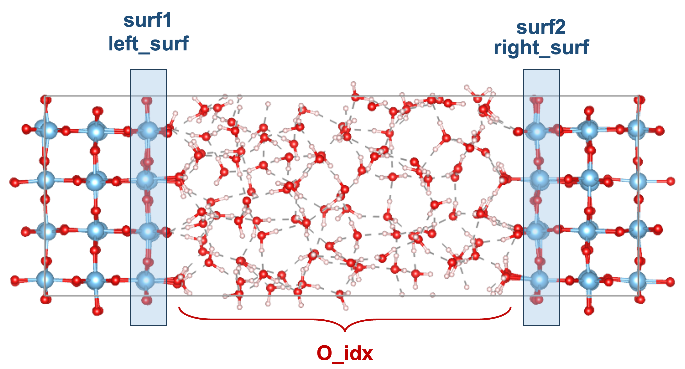

# Atom density analysis

Density analysis along the normal to an interface is very helpful for understanding the interface structure.{cite}`Fan.2023.10.1016/j.jechem.2023.03.013,Le.2017.10.1103/physrevlett.119.016801,Wen.2023.10.1021/acs.jpcc.3c00220,Guo.2018.10.1021/acs.chemmater.7b02619,Andrade.2020.10.1039/c9sc05116c` The density can be obtained using the `AtomDensity` class.
The following gives the introduction of the parameters used in the `inp_dict`, which is the input dictionary of the `AtomDensity` class.

First, we need to define the locations of the interfaces using the surface atom indices.
These indices can be readily found using the class `Slab`.
Note that the `Slab` class is inherent from `Atoms` class in `ase`.
In this way, we can either use the methods built in the `Atoms` class or the new methods created in `ECToolkits`

To initialize the `Slab` class, we can simply use `Slab` class in the `Atoms` object.

For example, you can substantialize a `Atoms` object by `ase.io.read`

```python
from ase.io import read
stc = read("rutile-interface.cif")
```
Then, you can pass the `Atoms` object `stc` to the `Slab` class method.
```python
from ectoolkits.structures.slab import Slab
stc = Slab(stc)
```
Once you create the `Slab` object, `Slab` object can use `find_idx_from_range` method to find the indices of atoms.
If the z coordinates of surface atoms are located in the range from 6.2 Angstrom to 7.2 Angstrom,
we can obtain the indices using the following codes,
```python
surf1_idx = stc.find_idx_from_range(zmin=6.2, zmax=7.2, element='Sn')
```
Here, the `zmin` and `zmax` define the lower and upper bounds of z coordinates.
The spcification of `element` is optional. If you don't define the element, the indices of all atoms located within this range will be retrevied. Note that, currently, this method only applys to the z coordinates.

Now you need to define the `surf1` and `surf2`.
The reason two interfaces exist is that the model is symmetric with respect to the slab's center plane, as shown in the following figure.
1. `surf1` represents the interface on the left, where the solid is to the left of the liquid.
2. `surf2` represents the interface on the left, where the solid is to the left of the liquid.


Note that it is unnecessary to post-process your trajectories by positioning the water phase in the center of the box as shown in the figure.

Next, we move to the analysis of water density at interfaces.

To perform the water density analysis, the indices of oxygen atoms between two interfaces are need to be specified, as shown in the `O_idx` of the above figure. Again, you can find the indices using the method `find_idx_from_range`, and put these indices (`List`) in the `inp_dict["density_type"]["idx_list"]`. Here, the `density_unit` should be set to `"water"` because the coordinates of oxygen atoms are treated as the positions of water molecules and are converted to water density through unit conversion.


Now, we import the analysis class `AtomDensity` and gather the following mentioned parameters.
```python
from ectoolkits.analysis.atom_density import AtomDensity

# from
inp_dict={
     "xyz_file": "./Hematite-pos-1.xyz", # the path to the xyz trajecotry.
     "cell": [10.0564, 8.7091, 38.506, 90, 90, 90], # the cell parameters
     "surf2": [32, 33, 34, 35, 36, 37, 38, 39, 40, 41, 42, 43], # the interface on the right
     "surf1": [112, 113, 114, 115, 116, 117, 118, 119, 120, 121, 122, 12], # the interface on the left
     "density_type":[
         {
             "element": "O",
             "idx_method": "manual",
             "idx_list": O_idx,
             "density_unit": "water",
             "dz": 0.05,
             "name": "O_density"
             },
         {
             "element": "H",
             "idx_method": "manual",
             "idx_list": H_idx,
             "density_unit": "water",
             "dz": 0.05,
             "name": "H_density"
             }
         ]
 }

ad = AtomDensity(inp_dict)
ad.run()

# detail information is accessible in
ad.atom_density
ad.atom_density_z

# get average denstiy from center
width_list = [5, 6, 7, 8, 9, 10]
all_cent_density = ad.get_ave_density(width_list)

# quick plot for denstiy
# if you want to symmetrize the density profile, set sym=True
ad.plot_density(sym=False)

```
