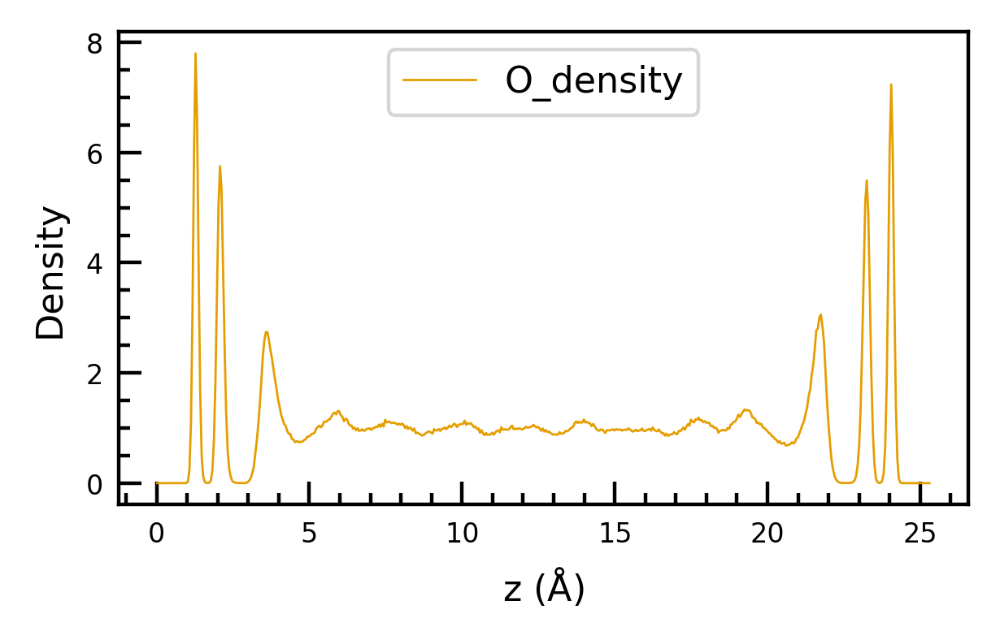

# Atom Density Analysis
```python
from ectoolkits.analysis.atom_density import AtomDensity

# from
inp_dict={
     "xyz_file": "./Hematite-pos-1.xyz",
     "cell": [10.0564, 8.7091, 38.506],
     "surf2": [32, 33, 34, 35, 36, 37, 38, 39, 40, 41, 42, 43],
     "surf1": [112, 113, 114, 115, 116, 117, 118, 119, 120, 121, 122, 12],
     "density_type":[
         {
             "element": "O",
             "idx_method": "manual",
             "idx_list": O_idx,
             "density_unit": "water",
             "dz": 0.05,
             "name": "O_density"
             },
         {
             "element": "H",
             "idx_method": "manual",
             "idx_list": H_idx,
             "density_unit": "water",
             "dz": 0.05,
             "name": "H_density"
             }
         ]
 }
ad = AtomDensity(inp_dict)
ad.run()

# detail information is accessible in
ad.atom_density
ad.atom_density_z

# get average denstiy from center
width_list = [5, 6, 7, 8, 9, 10]
all_cent_density = ad.get_ave_density(width_list)

# quick plot for denstiy
# if you want to symmetrize the density profile, set sym=True
ad.plot_density(sym=False)

```
