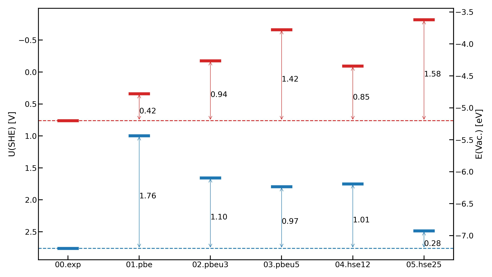

# Band Alignment
## Quick Start
```python
from ectoolkits..analysis.band_align import BandAlign
inp = {
     "input_type": "cube",
     "ave_param":{
         "prefix": "./00.interface/hartree/Hematite-v_hartree-1_",
         "index": (1, 502),
         "l1": 4.8,
         "l2": 4.8,
         "ncov": 2,
         "save": True,
         "save_path":"00.interface"
     },
     "shift_param":{
         "surf1_idx": [124, 125, 126, 127, 128, 129, 130, 131],
         "surf2_idx": [24, 25, 26, 27, 28, 29, 30, 31]
     },
     "water_width_list": [8, 9, 9.5, 10, 10.5, 11, 12, 13],
     "solid_width_list": [1, 2, 3, 4]

}
ba = BandAlign(inp)
#quick view of hartree fluctuation
fig = ba.plot_hartree_per_width('water')
fig = ba.plot_hartree_per_width('solid')

# detail information is accessible in
ba.water_hartree_list
ba.solid_hartree_list
```
## Prepare Input Data
One has to collect all hartree cube files from continuous MD simulations in one directory with same prefix and suffix of `.cube`.
For example, in directory `./00.interface/hartree/`, one should prepare cube file named `Hematite-v_hartree-1_1.cube`, `Hematite-v_hartree-1_2.cube`, ..., `Hematite-v_hartree-1_501.cube`.

## Explanation for Parameters

- `input_type`: `cube` for cp2k cube files
- `prefix`: define prefix for cube files
- `index`: define the index for cube files, see `Prepare Input Data`
- `l1`: parameter for nanosmoothing. `l1` equals to natural number (`n`) times periodic length (`pl`) for oxides slab. For example, the z position of a layer for $\mathrm{SnO_2}$(110) slab is defined as the ensemble-averaged z positions of $\mathrm{Sn}$ atoms in the layer. Then, the periodic length is inter-layer distance between two layers. Assuming `pl` is 2.4 $\mathrm{\AA}$, `l1` can be 2.4, 4.8, and 7.2 $\mathrm{\AA}$.
- `l2`: parameter for nanosmoothing. `l2` equals to natural number (`n`) times periodic length (`pl`) for water. Since water dose not have periodicity, we recommend to set `l2` same as `l1`.
- `ncov`: parameter for nanosmoothing. `ncov` is number of convolution. `ncov` equals to 2 for interfaces and equals to 1 for surface (slab-vacuum). When `ncov` is 1, `l2` won't be used.
- `save`: whether to save post processed hartree data. We recommend to set it as `True`.
- `save_path`: save_path for post processed hartree data.
- `surf1_idx`: `place holder`
- `surf2_idx`: `place holder`
- `water_width_list`: Width for bulk water. Bulk Water Width is plotted in above figure. Since one has to test multiple width value, the width is input as a list.
-  `solid_width_list`: Width for Bulk Solid. Bulk Solid Width is plotted in above figure. Since one has to test multiple width value, the width is input as a list.

## Plot Band Alignment Data
After Obtain band positions from post processing, you can plot these data using `plot_band_alignment`
```python
from ectoolkits.plots.band_align import plot_band_alignment

#prepare your band positions data in dictionary format
ba_data = {
    "sys_1": {
        "vbm": 1.0,
        "cbm": -0.5
    },
    "sys_2": {
        "vbm": 1.2,
        "cbm": -0.3
    },
    ....
}
fig = plot_band_alignment(ba_dict=ba_data, show_diff=True, vac_value=False)
fig.savefig("bandalignment.png")
```
We assume the vbm and cbm values are in SHE scale. If the vbm and cbm values are referred to Vacuum scale, set `vac_value=True`. If you want to plot the difference between band position of first system and other systems, set `show_diff=True`.
