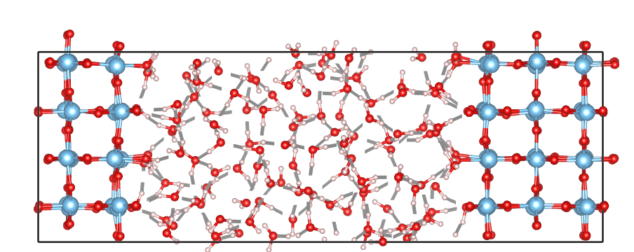

# Use Slab Class

## Check if slabs cross z boundary

In some cases, the solid parts of slab/interface models may cross the z boundary. For example, the following image shows a rutile part in the rutile-water interface that crosses the z boundary:


To check if a solid part crosses the z boundary, use the Slab.is_cross_z_boundary method. Here is an example usage:
```python
stc = Slab(stc)
# The element argument specifies the element in the slab part.
stc.is_cross_z_boundary(element='Ti')
```
```shell
# output
True
```

## Obtain the indices of Surface Atoms in Slabs/Interfaces

```python
#Find the indices of the upper surface, which is defined as the surface in contact with water on the right.
stc.find_surf_idx(element='Ti', tolerance=1, dsur='up', check_cross_boundary=True)
#Find the indices of the bottom surface, which is defined as the surface in contact with water on the left.
stc.find_surf_idx(element='Ti', tolerance=1, dsur='dw', check_cross_boundary=True)
```

```shell
# upper surface
[4, 9, 34, 39, 64, 69, 94, 99, 124, 129, 154, 159, 184, 189, 214, 219]
# bottom surface
[0, 5, 30, 35, 60, 65, 90, 95, 120, 125, 150, 155, 180, 185, 210, 215]
```