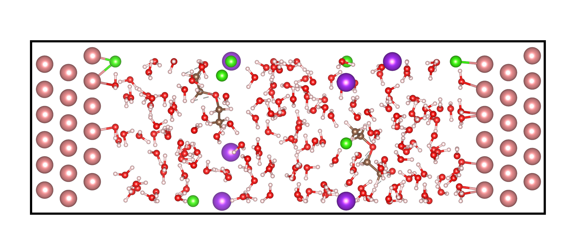

# Use Slab Class

## Check if slabs cross z boundary

In some cases, the solid parts of slab/interface models may cross the z boundary. For example, the following image shows a rutile part in the rutile-water interface that crosses the z boundary:


To check if a solid part crosses the z boundary, use the Slab.is_cross_z_boundary method. Here is an example usage:
```python
stc = Slab(stc)
# The element argument specifies the element in the slab part.
stc.is_cross_z_boundary(element='Ti')
```
```shell
# output
True
```

## Obtain the indices of Surface Atoms in Slabs/Interfaces

```python
#Find the indices of the upper surface, which is defined as the surface in contact with water on the right.
stc.find_surf_idx(element='Ti', tolerance=1, dsur='up', check_cross_boundary=True)
#Find the indices of the bottom surface, which is defined as the surface in contact with water on the left.
stc.find_surf_idx(element='Ti', tolerance=1, dsur='dw', check_cross_boundary=True)
```

```shell
# upper surface
[4, 9, 34, 39, 64, 69, 94, 99, 124, 129, 154, 159, 184, 189, 214, 219]
# bottom surface
[0, 5, 30, 35, 60, 65, 90, 95, 120, 125, 150, 155, 180, 185, 210, 215]
```


## Generate an Interface Containing Ions or Organic Molecules in Distinct Regions

In many interfacial simulations, it is necessary to include ions or organic molecules—especially those that exhibit chemical adsorption. The generate_components_symmetry_box() method allows precise control over the spatial distribution of different species in the system.

For example, the image below shows an interface model constructed with ions and organics distributed in adsorption and bulk regions:



```python
#
from ase.build import fcc111
from ase.io import write
from ectoolkits.structures.slab import Slab

# Build a 6×6×6 Cu(111) slab with orthogonal unit cell and 1.5 Å vacuum
slab = fcc111('Cu', size=(6, 6, 6), a=3.57, vacuum=1.5, orthogonal=True)
slab = Slab(slab)

# Define water box height
water_box_len = 30

# Generate symmetric water box with:
# - [Cl-] in the adsorption region (1 molecule)
# - (CCOCCO), [K+], and [Cl-] in the bulk region (1, 3, and 3 molecules respectively)
# Adsorption zone is 0.5, bulk region spans from 6 Å (bottom) to 10 Å (top)
slab.generate_components_symmetry_box(
    water_box_len,
    ads_components_smiles=['[Cl-]'], ads_components_counts=[1],
    bulk_components_smiles=['CCOCCO', '[K+]', '[Cl-]'], bulk_components_counts=[1, 3, 3],
    ads_limit=0.5, bulk_dw=6, bulk_up=10
)

# Identify top and bottom surface atom indices
top_surface_idx = slab.find_surf_idx(element='Cu', tolerance=0.1, dsur='up')
bottom_surface_idx = slab.find_surf_idx(element='Cu', tolerance=0.1, dsur='dw')

# Generate the final interface structure
interface = slab.generate_interface(
    water_box_len=water_box_len,
    top_surface_idx=top_surface_idx,
    bottom_surface_idx=bottom_surface_idx
)

# Write to XYZ file
write('coord.xyz', interface)
```
