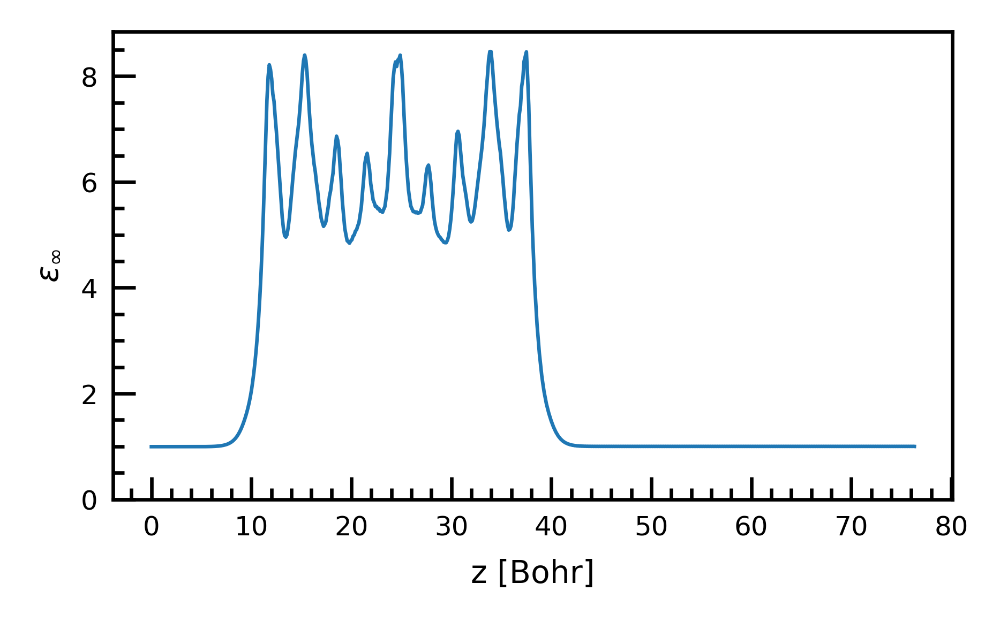

# Workflow: Calculation of Dielectric Constant

**This workflow is under testing and not yet to be used**

**This workflow is powered by dpdispatcher**

**This workflow only uses CP2K**


## Usage
```shell
eckits wkflow calc_diel -i input.yaml -m machine.yaml -r resources.yaml
```


Example: `input.yaml` for the calculation of global dielectric constant:
```yaml
input_file: "template.inp" # the template file of cp2k input.
eps_type: "optical" # optical or static
scale: "global"   # global or atomic
intensity_array: [0.0000, 0.0001, 0.0002] # List for global or Value for atomic
axis: "z" # the direction in which the electric field is applied
output_dir: "./output"  # the directory/folder that saves the calculations and resutls
command: "srun cp2k.psmp -i input.inp" # command to run cp2k in
extra_forward_files: [
  "anatase_bulk_relaxed.xyz" # extra files that are copied to calculation
]
extra_forward_common_files: [ # extra common files that are copied to calculation
]
restart_wfn: "restart.wfn" # the path of restart wavefunction for calculation
```

Example: `input.yaml` for the calculation of atomic dielectric constant:
```yaml
input_file: "template.inp"
eps_type: "optical"
scale: "atomic"
intensity: 0.0001
axis: "z"
output_dir: "./output"
command: "srun cp2k.psmp -i input.inp"
extra_forward_files: [
  "rutile_pristine_relaxed.xyz"
]
extra_forward_common_files: [
]
restart_wfn:   "restart.wfn"

```

Example: `machine.yaml`:
```yaml
batch_type: "Slurm"
context_type: "LocalContext"
local_root: "./"
remote_root: "./work_dir"
```

Example: `resources.yaml`:
```yaml
cpu_per_node: 12
gpu_per_node: 1
number_node: 4
exclude_list: []
custom_flags:
  - "#SBATCH --job-name='miniwkflow'"
  - "#SBATCH --account='blabla'"
  - "#SBATCH --mail-type=ALL"
  - "#SBATCH --mail-user=blabla"
  - "#SBATCH --constraint=gpu"
  - "#SBATCH --cpus-per-task=1"
  - "#SBATCH --time=24:00:00"
source_list: []
module_list:
  - "daint-gpu"
  - "CP2K"
envs:
  OMP_NUM_THREADS: "$SLURM_CPUS_PER_TASK"
  CRAY_CUDA_MPS: "1"
prepend_script:
  - "ulimit -s unlimited"
time_limit: "24:00:00"
queue_name: "normal"
group_size: 1
```

## Results


### Global Dielectric Constant
The reuslted figure would be saved in output_dir/"dielectric_fitting.png"


### Atomic Dielectric Constant
The reuslted figure would be saved in output_dir/"dielectric_profile.png"



## Principle
ECToolkits provides the workflow for calculating ab initio dielectric constant using CP2K.

For detail description, users are referred to this paper {cite}`Umari.2002.10.1103/physrevlett.89.157602` for the calculation of global dielectric constant,
and this paper {cite}`10.1103/physrevb.71.144104` for the calculation of atomic dielectric constant


Basically, we need to calculate dipole moments with varying electric fields. Then, fit the data to the following equation:

$$
\varepsilon = 4\pi\frac{M}{\Omega E} + 1
$$


# Bibliography
```{bibliography}
```